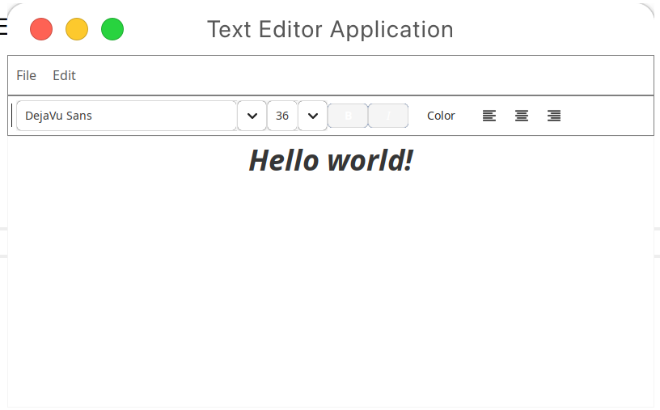

# Text editor app

A simple and lightweight text editing application build with Java Swing. I made this project during the Object Oriented Programming course in my university.

## UI



## Requirements

- Java 21
- Maven

## Installation

1. Clone the repository:
```
git clone https://github.com/furaizi/OOP-RGR.git
cd OOP-RGR
```

2. Run the application
```
mvn exec:java
```

